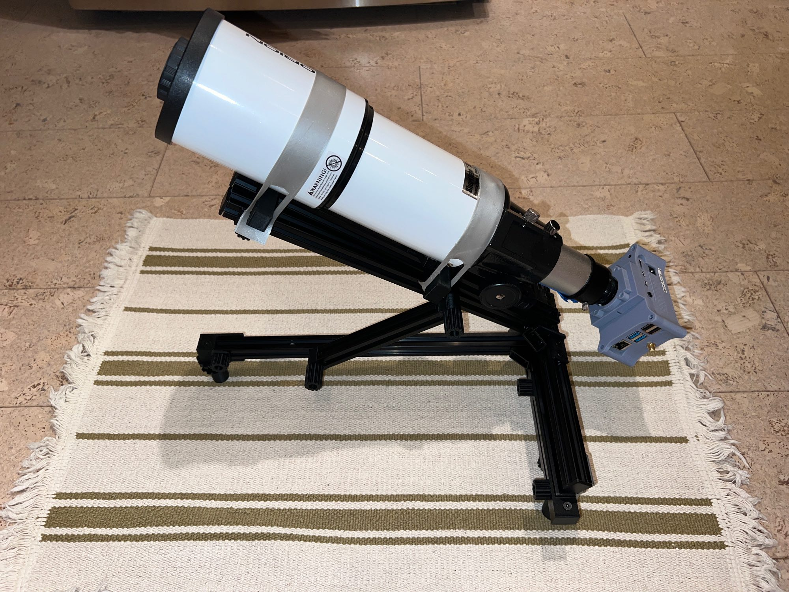

# T-Slot Broughton Mount

#### Author: ChasinSpin

The T-Slot Broughton Mount is a fixed-position AltAz telescope mount designed primarily for pre-point asteroid occultations with smaller telescopes. It is similar to a tripod, but easier and more precise when adjusting. Better than 1-arcmin precision is easily achievable in practice.

This mount is inspired by the original Paver Mount design of John Broughton and has similar dimensions.

The design uses 2020 Aluminum T-Slot, 3D-Printed parts, and is easy to build.

##### Overview:

* [Features](#features)
* [Supported Telescopes](#supported-telescopes)
* [Printing 3D Parts](#printing-3d-parts)
* [Azimuth Adjustment](#azimuth-adjustment)
* [Altitude Adjustment](#altitude-adjustment)
* [Collapsing For Transport](#collapsing-for-transport)
* [Marking Settings For Later Deployment](#marking-settings-forlater-deployment)
* [Attaching Telescopes](#attaching-telescopes)
* [High Altitudes near Zenith](#high-altitudes-near-zenith)
* [Use With 12inch Pavers](#use-with-12inch-pavers)
* [Extending For Larger Scopes](#extending-for-larger-scopes)
* [Paver Registration](#paver-registration)
* [Repeatability](repeatability)
* [Anti-Tip-Over Bar](anti-tip-over-bar)
* [Parts List](#parts-list)
* [Add-Ons](#add-ons)

##### Guides:

* [Assembly Guide](docs/assemblyguide.md)
* [Usage Guide](#usage-guide)

## Features

* Low profile
* Parametric design in [OpenSCAD](https://openscad.org). Can easily be adapted. 
* Full range (0-90 degrees in altitude - zenith works)
* Small and lightweight (3lb/1.375kg), ideal for air travel (can also be disassembled)
* Supports "pre-point later". (Set up, remove, and place back in position days later)
* Collapsable for transport (and can be put back to the previous AltAz position)
* Both coarse and fine adjustments for altitude and azimuth
* Rigid design
* Silver or black (black for stealth deployments)
* 2020 Aluminum T-Slot, using standard parts
* Easy to build (hacksaw, file, drill, 3D printed parts)
* Can be used with a 12" or 16" paver, staked piece of plywood for pre-positioning days prior
* Anti Tip-Over Bar
* Cost-effective
* Can be adjusted to better than 1-arcmin precision

## Supported Telescopes

Many small telescopes are supported, for example:

* Mighty Mini (IOTA) - (1/4-20 UNC standard tripod thread)
* Orion ST (Short Tube) 80mm
* If the scope is larger, the design can be expanded, see [Extending For Larger Scopes](extending-for-larger-scopes)

The [Astrid](https://github.com/ChasinSpin/astrid) astro imaging device is also supported.

## Printing 3D Parts

If you have a 3D filament printer, then you're good to go. It's also possible to order the parts printed for you via a 3D printing service. The parts are designed to be printed in PLA, but other materials can be used.

[STL Files](stl)

## Azimuth Adjustment

Coarse azimuth adjustments can be made by rotating the mount on the surface it's standing on.  Fine adjustments can be made with 2 fingers pushing against the 2 pieces of 2020 to displace the position and the thumbwheel can be used to tighten.

## Altitude Adjustment

Coarse altitude adjustments can be made by raising/lowering the altitude bar and tightening the knobs.  Fine adjustments can be made by using the screw in the foot at the front of the mount.

## Collapsing For Transport

The mount can be completely collapsed for transport.  Additionally, if air traveling and an extremely minimal footprint is required, an Allen key can be used to detach the cross bars for transport.

## Marking Settings For Later Deployment

Move the altitude position markers up against the altitude bar to save the position, and tighten and disconnect the altitude bar.

An alternative is to use a 0.4mm Sharpie felt pen to mark the position of both ends of the altitude bar on the aluminum.  To remove the marking later, any type of alcohol can be used to remove.

The altitude fine adjustment foot can be locked in place using the lock wheel provided.

For azimuth, use the graduated scale near the front of the mount, and note the position (or take a photo).  Alternatively, calipers can be used to note the measurement for later.

## Attaching Telescopes

Telescopes can be attached via a stretchable band 3d printed from NinjaFlex or TPU.  Also, just a length of TPU/NinjaFlex filament, thick rubber band or strong elastic can be used.

## High Altitudes near Zenith

Due to the weight of the scope and the possibility of tip-over, for higher altitudes nearer to the zenith, the anti-tip-over bar should be swung out to prevent tip-over.  See [Anti-Tip-Over Bar](#anti-tip-over-bar)

## Use With 12inch Pavers

The original paver mount has its feet removed for placement on a 12-inch paver as the mount is larger than the paver.  The T-Slot Broughton Mount can be used the same way by removing the rear feet. Next, remove the front foot, and insert backward through the hole and T-Nut further back along the T-Slot to retain the fine altitude adjustment.

Another option is to slide the rear feet so they are just under 12 inches apart and also reverse the front foot as previously described for the fine altitude adjustment.

## Extending For Larger Scopes

The design is extendable within sensible limits for larger telescopes, by increasing the length of the 2020 extrusion in the same proportion for all parts.

 - With label on illustrating what to make longer

## Paver Registration

Repeatable registration of the mount feet with the paver can be accomplished by epoxying or super-gluing the paver makers at the edges of the paver.  Place the right-angled marker against the left corner and the straight marker against the same edge such that the left rear foot of the mount fits in the right-angled marker, and the right rear foot of the mount rests against the straight marker.

## Repeatability

The following testing is with an Orion ST 80mm and IOTA Focal Reducer 0.5X with focal length 185mm and 1.543x1.154deg FOV.

**Initial** refers to the error after adjusting the mount to the pre-point location.  **Reposition** are subsequent measurements after repositioning the mount.

**Error Az/Alt** are in arc minutes and are the difference between where the telescope is pointing and the pre-point location of the target at that time.  **Error FOV** is the same error represented as a percentage of the Field of View, where the height of the field of view is 100%.

### Testing repeatability in pre-pointing with Astrid

After initial pre-point alignment and lockdown of the mount, the scope was picked up with the mount and placed back on the paver, to simulate a pre-point where the setup is removed and replaced days later.

| Step | Error Az (arcmin) | Error Alt (arcmin) | Error FOV |
| ---- | -------- | --------- | --------- |
| Initial | -0.582 | -0.995 | 1.4% |
| Reposition | -3.690 | +0.638 | 5.3% |
| Reposition | -1.971 | +1.373 | 2.8% |
| Reposition | -1.710 | +1.539 | 2.5% |
| Reposition | +0.489 | +2.634 | 3.8% |
| Reposition | -6.155 | +2.172 | 8.9% |
| Reposition | -5.880 | +2.691 | 8.5% |
| Reposition | +3.263 | +3.217 | 4.7% |

### Testing repeatability for "pre-point later" with Astrid after mount collapse and telescope removal for transport

After initial pre-point alignment, the telescope was removed from the mount,
and the mount collapsed for transport.  The altitude bar position was maintained via the altitude bar markers, and the azimuth scale was noted.  The setup was then reassembled and aligned with the paver.

| Step | Error Az (arcmin) | Error Alt (arcmin) | Error FOV |
| ---- | -------- | --------- | --------- |
| Initial | | | |
| TESTING PENDING

## Anti-Tip-Over Bar

The design has an anti-tip-over bar that can be swung out to the rear of the scope to prevent tip-over of the scope at high elevations.  The anti-tip-over bar does not fit the 12-inch paver due to the paver's small size.

The Anti-Tip-Over Bar is optional and can be omitted for many occultations.

## Parts list

| Qty | Part | Description |
| --- | ---- | ----------- |
| 5 | 2020 x 360mm | [2020 EU STandard T-Slot](https://spool3d.ca/2020-aluminum-extrusion/) - 360mm Length (Silver or Black) |
| 1 | 2020 x 270mm | [2020 EU STandard T-Slot](https://spool3d.ca/2020-aluminum-extrusion/) - 270mm Length (Silver or Black) |
| 1 | 2020 x 160mm | [2020 EU STandard T-Slot](https://spool3d.ca/2020-aluminum-extrusion/) - 160mm Length (Silver or Black) |
| | | Note above T-Slot can be purchased as a 1 x 1.5m and 1 x 1m and cut to size or 3 x 1m | 
| 4 | 2020 Corner Bracket | [2020 Aluminum Corner Bracket Small](https://spool3d.ca/2020-aluminum-corner-bracket-small/) (Silver of Black) |
| 2 | 2020 Hinge | [2020 Aluminum Hinge](https://spool3d.ca/2020-aluminum-hinge/) (Silver or Black) |
| 26 | M5 x 8mm | [M5 Low Profile Bolt](https://spool3d.ca/m5-low-profile-screws/) - 8mm Length - Dimensions: (head diameter = 8.8mm, head thickness = 1.7mm) |
| 2 | M5 x 15mm | [M5 Low Profile Bolt](https://spool3d.ca/m5-low-profile-screws/) - 15mm Length - Dimensions: (head diameter = 8.8mm, head thickness = 1.7mm) |
| 4 | M5 x 35mm | [M5 Low Profile Bolt](https://spool3d.ca/m5-low-profile-screws/) - 35mm Length - Dimensions: (head diameter = 8.8mm, head thickness = 1.7mm) |
| 1 | M5 x 45mm | [M5 Low Profile Bolt](https://spool3d.ca/m5-low-profile-screws/) - 45mm Length - Dimensions: (head diameter = 8.8mm, head thickness = 1.7mm) |
| 1 | M5 x 50mm | [M5 Low Profile Bolt](https://spool3d.ca/m5-low-profile-screws/) - 50mm Length - Dimensions: (head diameter = 8.8mm, head thickness = 1.7mm) |
| 36 | M5 T-Nut | [M5 Sliding T-Nut](https://spool3d.ca/m5-sliding-t-nut/). Note, these are not twist in or "hammer head" T-Nuts, i.e. these are regular T-Nuts that won't fall out of the T-Slot.
| 10 | M5 Nut | M5 Nut - Dimensions: (diameter =  9mm point to point, thickness = 3.9mm) |
| 10 | End Cap | [Aluminum Extrusion Plastic Cap](https://spool3d.ca/aluminum-extrusion-plastic-cap/) |
| 1 | 3D Plate1 | Plate 1 3D-Printed Parts PLA |
| 1 | 3D Plate2 | Plate 2 3D-Printed Parts PLA |
| 1 | 3D Mount | 3D-Printed Mount PLA, e.g. Mount Orion ST 80mm or 1/4" Mount |
| 1 | 3D Bands | Bands 3D-Printed TPU/NinjaFlex to hold Orion ST 80mm telescope or strong rubber bands |
| 1 | 1/4-20 UNC Bolt | 1/4-20 UNC Bolt (regular tripod bolt) for 1/4 inch tripod mount if used) |
| 1 | Double Sided Tape | Permanent double-sided (e.g. Scotch Extreme Mounting Tape or Hot Glue) to attach telescope slide stops to telescope (Orion ST 80mm) |

**Note: All bolts are measured from the tip to the start of the head flange and do not include the thickness of the head.**

## Add-Ons

T-Slot is highly configurable.  If you design some fittings to work with this mount for telescopes, accessories, or anything else... please use [OpenSCAD](https://openscad.org) to design so that it is parametric and upload it to GitHub with a picture and README.md as a pull request, so others can benefit.  All submissions are assumed to be open source and under the MIT license.

[List of Add-Ons](/addons/README.md)

## Guides

* [Assembly Guide](docs/assemblyguide.md)
* [Usage Guide](#usage-guide)

## Credits

* John Broughton - Inspiration from the original Paver Mount
* Steve Preston - Dimensions and scope configuration