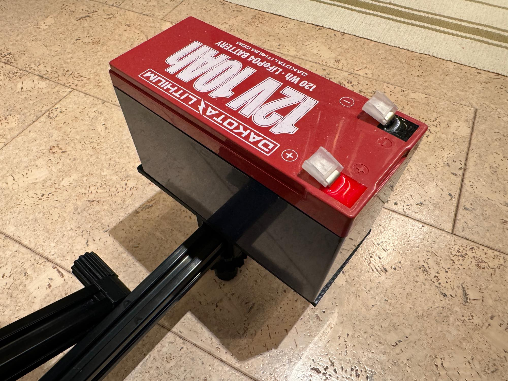
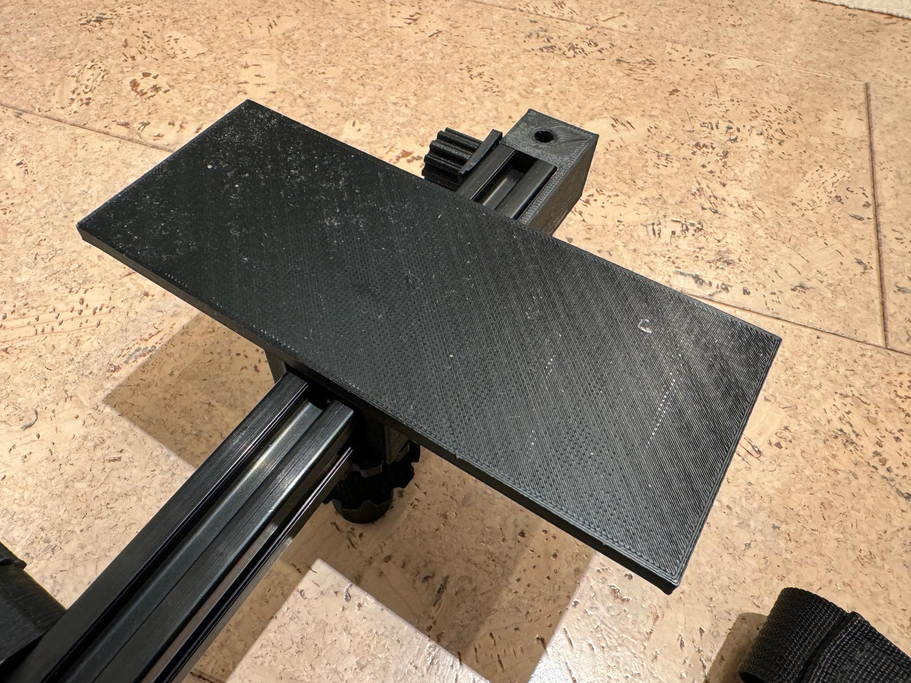

# Battery Platform

Detachable platform to serve as weight and a location to place the battery.

## Parts

| Qty | Part | Description |
| --- | ---- | ----------- |
| 1 | 3D Printed Parts | The 3D printed parts in the STL below.  Print 15% fill and with support |

## Assembly

Place on top of the T-Slot
 
## Files

* [STL](batteryplatform.stl)
* [OpenScad](batteryplatform.scad)
