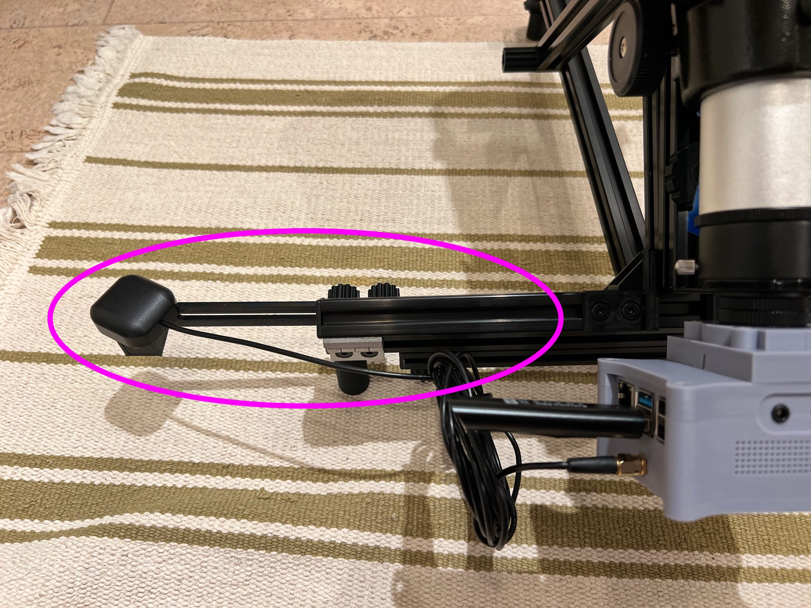

# Magnetic GPS Antenna Holder

Retractable arm to hold a magnetic GPS antenna.

## Parts

| Qty | Part | Description |
| --- | ---- | ----------- |
| 1 | 3D Printed Parts | The 3D printed parts in the STL below.  Print 15% fill and with support |
| 1 | M5 x 8mm | [M5 Low Profile Bolt](https://spool3d.ca/m5-low-profile-screws/) - 8mm Length - Dimensions: (head diameter = 8.8mm, head thickness = 1.7mm) |
| 2 | M5 x 15mm | [M5 Low Profile Bolt](https://spool3d.ca/m5-low-profile-screws/) - 15mm Length - Dimensions: (head diameter = 8.8mm, head thickness = 1.7mm) |
| 2 | M5 T-Nut | [M5 Sliding T-Nut](https://spool3d.ca/m5-sliding-t-nut/). Note, these are not twist in or "hammer head" T-Nuts, i.e. these are regular T-Nuts that won't fall out of the T-Slot.
| 2 | M5 Nut | M5 Nut - Dimensions: (diameter =  9mm point to point, thickness = 3.9mm) |

## Assembly

Screw a M5x8mm bolt into the tapered hole, the antenna magnetically attaches to this.  Use 2 x M5x8mm and 2 x T-Nut in the remaining holes (one of which is a long hole.

Assembly the knobs with the M5 nuts and M5x15mm bolts.  Screw the knob through the holes into the T nut in the 2020 profile.
 
## Files

* [STL](maggpsholder.stl)
* [OpenScad](maggpsholder.scad)
