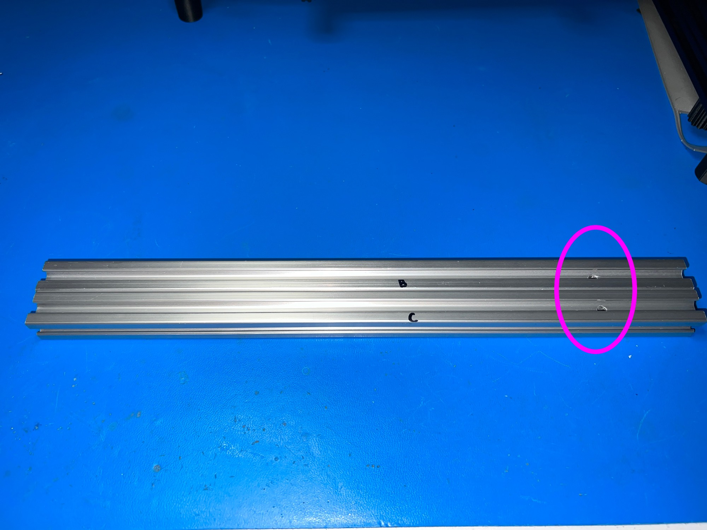

# Assembly Guide

## Tools Required:

* Hobby Knife
* Hacksaw and Miter Box
* Drill Bit 5mm (ideally) or 13/64" (slightly larger)
* Drill
* Metal File or Coarse Belt Sander
* Coarse Sand Paper
* Superglue
* Pliers
* 3mm Allen Key
* Double Sided Permanent Tape

## Important Warnings: 
1. Fine aluminum dust/chips created by sanding, cutting, and filing can combust and be an explosion hazard when provided with an ignition source.  Clean the work area frequently and avoid ignition sources.

2. Wear protective eyewear/gear.

It's recommended that foam/felt or other materials are not used on the telescope saddles if the mount is intended to be used for "pre-point later" so that the telescope will be in the same place when reassembled.  The telescope stops should be used instead to prevent the telescope from slipping backward at higher elevations.

## Part Identification

## Instructions

From Step 3, assembly time takes about 50 minutes.

### 2020 T-Slot Profile Cut Summary (see steps below for more details)

| Part # | Length | 5mm Drill Holes |
| ------ | ------ | --------------- |
| A | 360mm | 1 @ 100mm from end |
| B | 360mm | 1 @ 51mmm from end |
| C | 360mm | 1 @ 51mmm from end |
| D | 360mm | No Holes |
| E | 360mm | No Holes |
| F | 160mm | No Holes |
| G | 270mm | 2 @ 13mm (from each end) |

Note: For part G, the 2 drill holes are in the same orinetation.

### Step 1

Cut the 2020 T-Slot Profile to length.  Hacksaw is the safest way to this and can be squared off with filing or sanding.  

Miter Saw (Chop Saw) with a blade designed for cutting aluminum profile (Non-Ferrous) can also be used for clean straight cuts, however it carries a certain amount of risk of bodily harm so appropriate safety gear should be used, parts anchored down etc.  If you wish to use this approach, please research appropriately before embarking.

Cut 7 lengths:

* ABCDE - 5 x 360mm - (Labeled ABCDE)
* F - 1 x 160mm (Coarse Altitude Bar)
* G - 1 x 270mm (Anti-Tip-Over Bar)

Deburr/sand any sharp edges.

### Step 2

Using the Part Identification Guide Above, locate the Altitude Bar Bearings (17).

Use super glue to glue the bearings to the ends of the Coarse Altitude Bar, ensuring that they are flush with the end and both holes are oriented in the same direction.  You may need to trim the bearings carefully with a hobby knife to sit flush with the end.

Let dry a couple of hours before handling.

### Step 3

Find Plate 1 - 5 (Front Foot Lock) and Plate 2 - 11 (Front Foot Holder).  Insert an M5 Nut into each of the hex nut holders and make sure the are square with the surface and fully inserted.  Now put a drop of super glue on opposite sides where the nut abuts the plastic, the super glue will wick into the gap.  Be careful not to use too much superglue and contaminate the threads.

Let dry a couple of hours before handling.

### Step 4

From Plate 1 locate parts 10, 12, 13, 14, 15, 16. Make sure the holes are clear of plastic filament, and insert an M5 Nut into each hex nut holder.  Now insert the appropriate bolt length (indicated on the Plate 2 diagram), and tighten fully using an Allen key.  (Do Not Use Superglue).  Note parts 10 and 16 are similar in length and part 16 is slightly shorter than 10.

### Step 5

Take a piece of 360mm profile and drill a 5mm hole 3 29/32"/ 100mm from the end. Label Part A (Permanent Marker works well and can removed with alcohol).  Be careful to center the hole (a larger drill bit that just fits within the extrusion, can help mark before using the smaller drill).

### Step 6

Take 2 pieces of 360mm profile and drill a 5mm hole 2"/51mm from the end on both pieces.  It is important these holes are centered and straight and not oversized, if you have a drill press, then use that, otherwise drill carefully.  The holes should be in the same place on both pieces, so it may be easier to drill them together.  Label these B and C.

### Step 7

Take the 270mm profile and drill 2 - 5mm holes 0.5"/13mm in from the ends.  Label this part G.

### Step 8

Take part A and part D and place part A in the center of part D using 2 corner brackets and 4 - T-Nuts / 4 - M5x8mm bolts. The corner brackets have elongated holes and for best rigidity, the bolts should be furthest away from the center of the corner in this hole. It's best to assemble this part of the frame on a flat surface, and only loosely tighten the bolts until you have everything square and flush, then fully tighten.  The hole in part A should be pointing vertically and furthest away from part D.

### Step 9

Repeat step 9 with parts B and E. For this assembly, the hole in part B should be located closest to part E.  Put this assembly on top of the assembly from Step 8 and make sure all parts line up before tightening the bolts down.

### Step 10

Take part C and put an end cap on the end closest to the hole, push against a flat surface to put the end cap in.

On a flat surface, insert a T-Nut into the bottom of part B and line up with the hole. Place part C on top and line that up with the hole in part B.  Now take Plate 2 - 13 (Azimuth Rotator) and screw through the top, and bolt B/C together so that it's just friction tight.

### Step 11

Locate Plate 2 - 11 (Front FootHolder), and place 2 - M5x8mm bolts into the 2 holes oriented such the the bolt head fits into the recess in the holder.  Now loosely attach 2 - T-Nuts to the bolts.

Insert a T-Nut into bottom of Part A and an additional 2 - T-Nuts into the side (Altitude Marker and the Coarse Altitude Bar), slide on the FootHolder and tighten the FootHolder bolts with the holder flush against the end of the profile.

When correct, the loose T-Nut and the M5 Nut in the foot holder will be orientated on the same side.

### Step 12

With the 2 hinges and 8 - T-Nuts and 8 - M5x8mm, put the bolts in the hinges and loosely attach the T-Nuts.

Taking assemblies A/D  and B/E, place B/E on top of A/D and slide in the hinges to the back of parts D and E. It is important to place the hinges at the end (furthest apart) to minimize any twisting motion.

Tighten loosely, and check the movement of the hinge through 90 degrees.  Adjust if necessary before tightening down.  You want to avoid any "play" in the movement.

### Step 13

Locate the azimuth stops (Plate 1 - 1 and 2) and using 4 - T-Nuts and 4 - M5x8mm, place the stops in part E on the top as shown.  Locate the stops such that the front of C does not move past B when moved left to right.

### Step 14

Take part G and slide a T-Nut over the hole.  Screw part 16 (Extension Bar Foot) in from the same side as the T-Nut.

Place end caps on both ends of part G.

Now place the T-Nut in the bottom of part D and using part 14, bolt through G into the T-Nut.

Fold part G so that it's inline with part A and tighten gently.

### Step 15

Assemble Plate 1 - 4 (Rear Foot x 2) with a M5x8mm bolt and a T-Nut.  Slide these 2 feet onto the ends of part D and finger tighten.

Screw Plate 1 - 5 (Front Foot Lock) onto Plate 2 - 12 (Front Foot) and then screw into the FootHolder at the front of Part A.

### Step 16

Insert a T-Nut into part B.  With part F (Coarse Altitude Bar), use Plate 2 - 10 (Altitude Knobs x2) to bolt through the holes in the bearing into the T-Nuts and tighten loosely. Note, the T-Nut used on part A should be the rightmost T-Nut.  Orient the smoothest side of the bearing towards parts A/B.

### Step 17

Insert a T-Nut into part B.  Locate parts Plate 1 - 3 (Altitude Markers x2) and parts Plate 2 - 15 (Altitude Marker Knobs x 2), and push the knob through the marker and bolt into the T-Slot as shown.

### Step 18

If using the Orion ST 80mm, locate parts 20 and 21 and using 4 - T-Nuts and 4 - M5x8mm, assemble and slide into the top of part C as shown, place scope on top, adjust and then tighten down. Note part 20 (widest groove) goes at the front.  Locate parts 23, and using permanent double sided tape on the curved side, attach to the scope such that the scope slides down against part 21 and rests when the mount is at higher elevations.  The scope should also be held down with either rubber bands or the 3d-printed NinjaFlex or TPU bands.

If using the 1/4" Mount, use 2 - T-Nuts and 2 - M5x8mm and slide into the top of part C.

### Step 19

Insert remaining end caps.

### Step 20 (Optional)

If using a paver to place the mount on, parts Plate 1 - 6 (Paver Registrations) can be glued to the paver as shown using Super Glue or Epoxy for repeatability in positioning.  The L shaped piece goes in a corner, and the straight piece at the opposite end of the adjacent edge to the corner piece.

