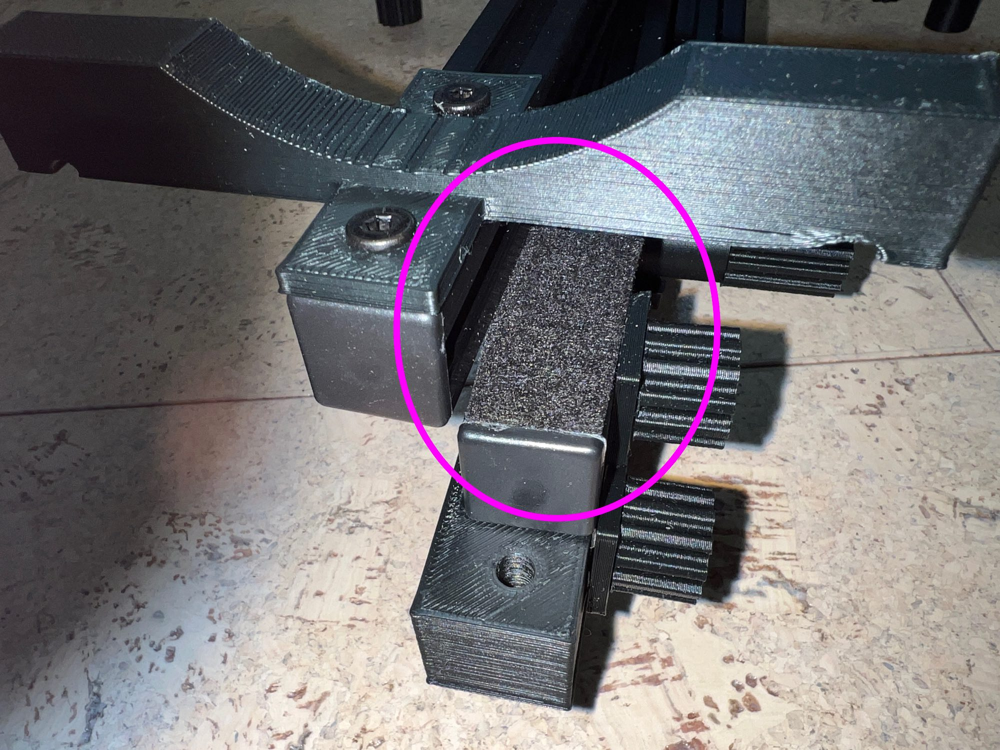

# Troubleshooting Guide

## Fine Azmiuth Adjustment Too Loose

Depending on the 2020 extrusion, the fine azimuth adjustment may be too loose.  Often a simple solution is to invert part C.  However, if that doesn't work, a small piece of adhesive 1mm felt at the end will provide the needed additional friction.

